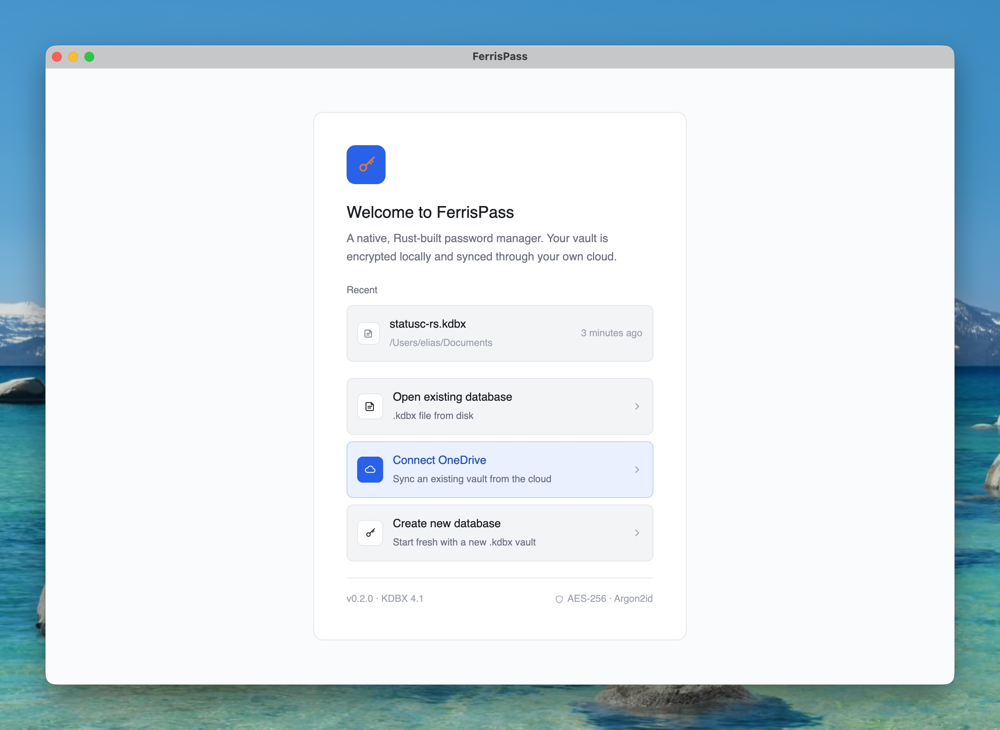
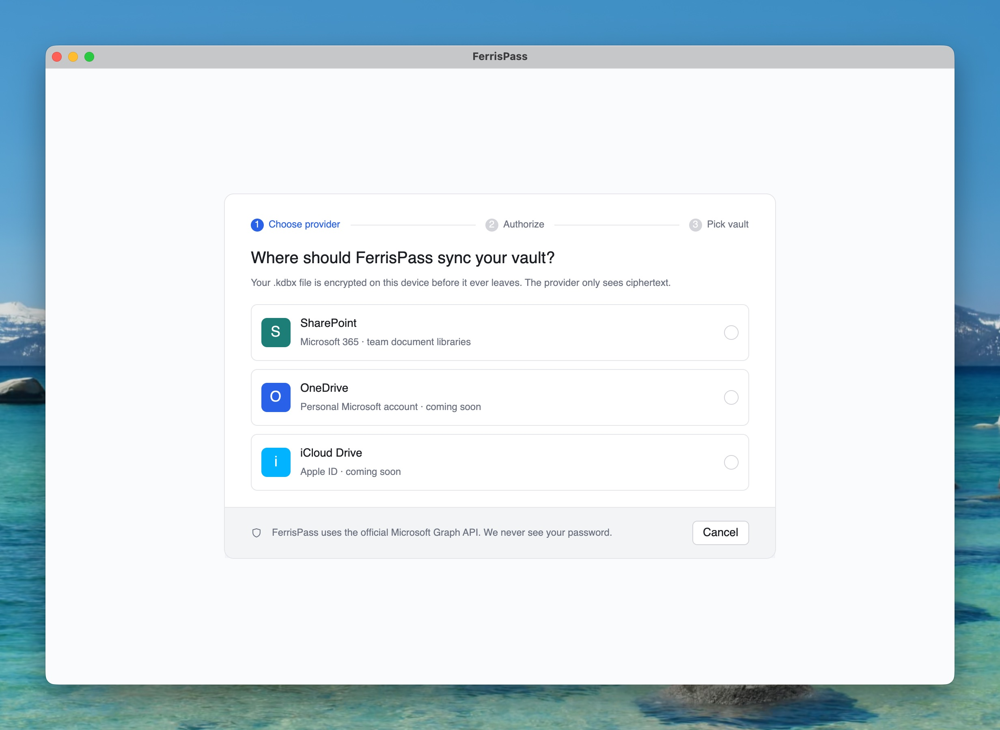
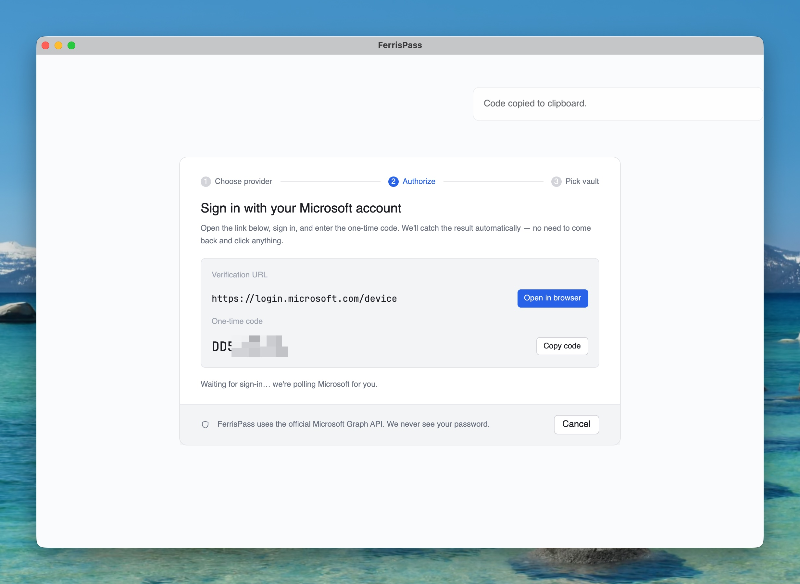
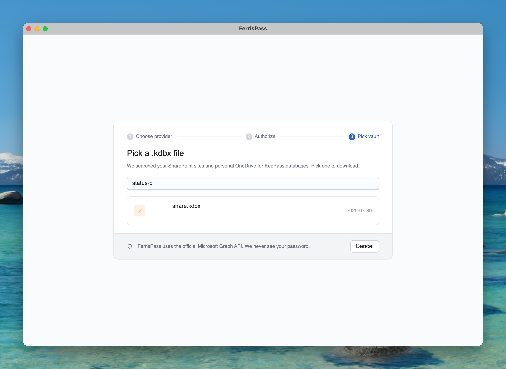
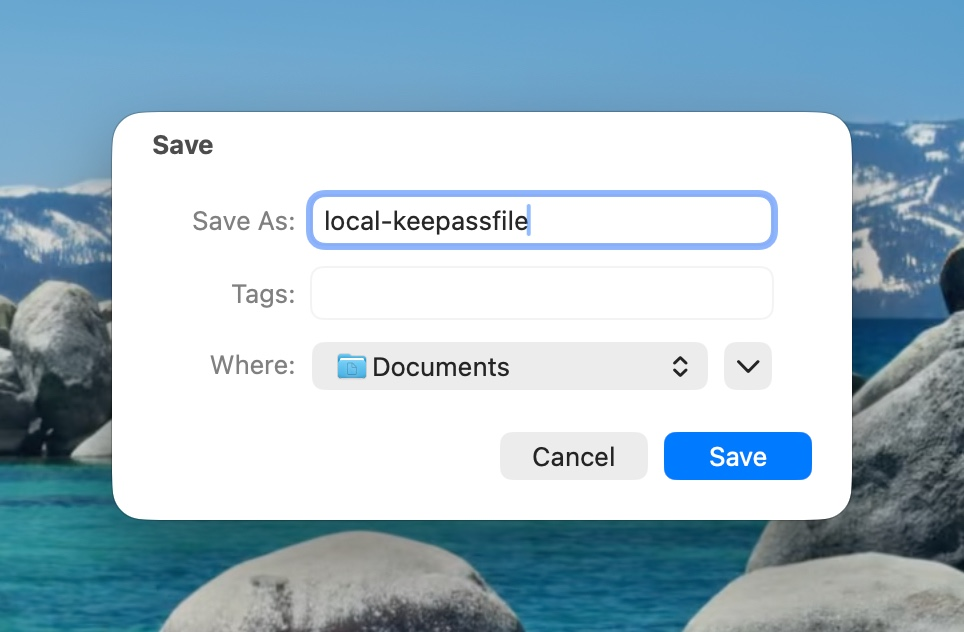
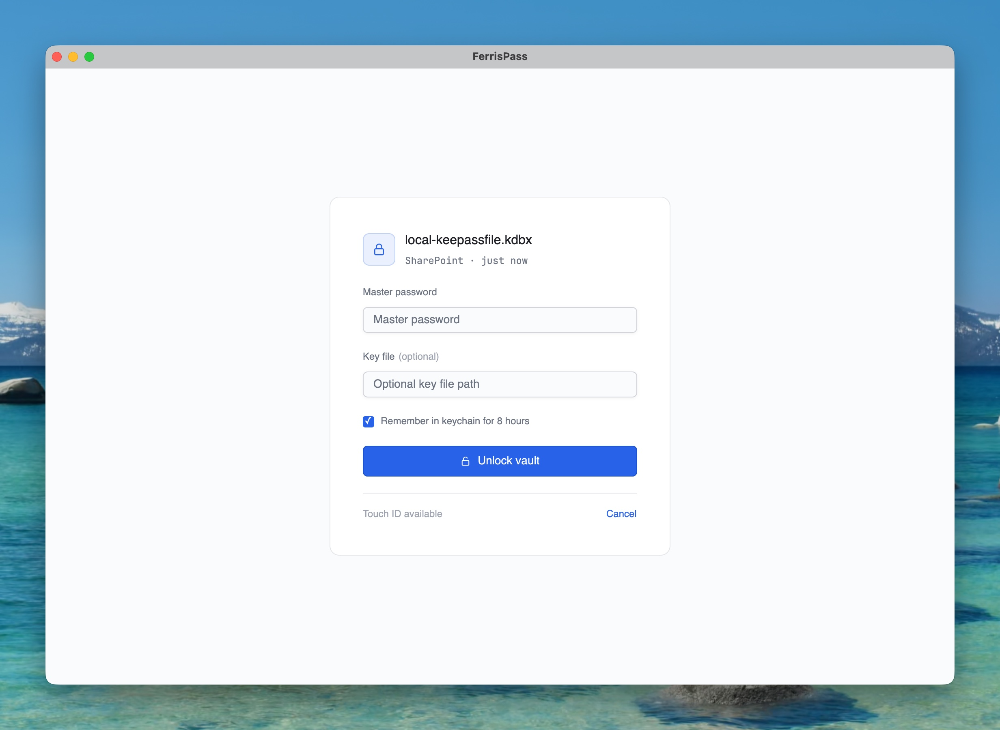

# Getting Started: SharePoint Sync

Keep your KeePass vault on a SharePoint document library and let FerrisPass handle the upload-on-save, conflict detection, and re-download across devices. Your `.kdbx` is encrypted on this device before it ever leaves; SharePoint only ever sees ciphertext.

This walkthrough covers the first-time connect flow on macOS. If you already have a vault unlocked, just go to **Settings → Sync → Connect** instead.

## Prerequisites

- A Microsoft 365 account with permission to read/write a SharePoint document library (or a personal OneDrive)
- An existing `.kdbx` file uploaded to that library — FerrisPass doesn't create the cloud-side file for you in v0.2, you bring your own
- macOS 12 (Monterey) or later, Apple Silicon

If your tenant has tightened admin policies, the OAuth grant for `Files.ReadWrite.All` may need a one-time admin approval. Ask your IT admin to consent if you hit "needs admin approval" during sign-in.

---

## 1. Open FerrisPass and start the connect flow

On the Welcome screen, click **Connect OneDrive**.

> **Heads up:** Despite the label, this entry kicks off the *SharePoint* flow — it covers SharePoint document libraries plus your personal OneDrive in a single sign-in. Dedicated OneDrive Personal and iCloud entries are placeholders for upcoming releases.

If you already have a vault open, the same flow lives at **Settings → Sync → Connect** (⌘⇧, jumps straight there).

## 2. Pick the provider

Click **SharePoint**. The other two options are wired in as placeholders so the visual roadmap is visible — only SharePoint is functional in v0.2.

## 3. Authorize via Microsoft device code

FerrisPass shows you two things:

1. A **verification URL** — `https://login.microsoft.com/device`
2. A **one-time code** — a short alphanumeric string (e.g. `DD5-XXXX-X`)

Click **Open in browser** and **Copy code**. In the browser tab that opens:

1. Sign in to your Microsoft account
2. Paste the one-time code when prompted
3. Approve the FerrisPass sign-in request

Back in FerrisPass — the screen advances automatically as soon as Microsoft confirms the sign-in. You don't need to click anything to come back. Polling is happening in the background.

> **Why device code, not browser PKCE?** No local web server, works behind NATs and corporate firewalls, no platform plumbing. The two-step UX is the trade-off — acceptable for a desktop password manager that signs in once per device.

## 4. Pick a vault file

FerrisPass searches across every SharePoint site and OneDrive folder your account has access to for `.kdbx` files. The list shows up to 50 results.

- Type to filter live — substring match against the file name
- Click a row to download

The search uses Microsoft Graph's `/search/query` endpoint with the KQL filter `filetype:kdbx`, so it covers the same scope as the SharePoint web search.

## 5. Choose where to save the local copy

macOS asks where to put the local working copy. `~/Documents/` is fine; pick whatever fits your file organization.

> **Why a local copy?** FerrisPass works on a local file (KDBX 4 with full Argon2id KDF) and uploads back to SharePoint after each save. The local copy is your low-latency working state; the SharePoint copy is the durable cross-device source of truth. They're kept in sync automatically.

The cloud-side file is **not** moved or renamed by this step. Only a local working copy is created.

## 6. Unlock with your master password

You're back in FerrisPass, on the Unlock screen. Notice the file metadata:

- **`local-keepassfile.kdbx`** — the file name you picked in step 5
- **`SharePoint · just now`** — confirms this vault is bound to a cloud source and was synced moments ago

Enter your KeePass master password and click **Unlock vault**.

### Optional: Touch ID / Keychain remember

The "Remember in keychain for 8 hours" checkbox stores the master password in the macOS Keychain for that window of time. Subsequent unlocks within 8 hours can use Touch ID (or your account password) instead of re-typing. Wipes when:

- The 8-hour timer expires
- You hit ⌘L (lock vault) explicitly
- You quit FerrisPass

The checkbox is per-vault — you can enable it on your daily vault and leave it off on a high-sensitivity one.

---

## After connect: the steady-state experience

Once the first connect is done, here's what happens day-to-day:

- **Edits save back automatically.** Add an entry, change a password, hit ⌘S — FerrisPass writes the local copy and queues an upload to SharePoint. The cloud copy updates within seconds.
- **Token refresh is invisible.** OAuth access tokens expire after ~1 hour. FerrisPass refreshes them silently in the background using a long-lived refresh token stored in the macOS Keychain (service `ferrispass-sync`).
- **Auto-resume on launch.** Next time you open FerrisPass, the most-recently-used vault opens directly to the unlock screen. No need to re-pick the cloud file.
- **Cross-device.** Repeat this same flow on a second Mac — connect to SharePoint, pick the same `share.kdbx`, save it locally as something different (`work-mac.kdbx`), unlock. Both Macs now sync to the same cloud vault.

## What if two devices edit at once?

FerrisPass uses HTTP ETags for optimistic-concurrency. If a save would overwrite a newer cloud version, the upload is rejected (HTTP 412 Precondition Failed) and FerrisPass:

1. Downloads the remote version
2. Decrypts it with your master password
3. Performs an **entry-level three-way merge** — you see a Conflict overlay listing every entry that diverged
4. You pick the winner per entry, or accept "keep both" (suffix added)
5. The merged file is re-uploaded with the fresh ETag

No data is silently lost. If the conflict resolver scares you, the safer path is to lock the vault on machine A before editing on machine B.

## Troubleshooting

**"Sign-in failed" or "needs admin approval"** — your tenant requires an admin to grant `Files.ReadWrite.All` once for the FerrisPass app registration. Forward the device-code link to a tenant admin who has consent rights, or run [`scripts/setup-minisign.sh` style fork instructions](../README.md#auto-updates) to register your own Azure AD app and override `FERRISPASS_CLIENT_ID` at build time.

**File doesn't appear in the picker** — the file must be a `.kdbx`, must live somewhere your account can search, and the search may take a few seconds to index a freshly-uploaded file. Try the SharePoint web search with the same file name to confirm it's reachable.

**"Code expired"** — you took longer than 15 minutes between getting the device code and completing the browser sign-in. Click **Cancel** and start over from step 3.

**"Sync failed: invalid_grant"** — your refresh token is no longer valid (typically because you signed out elsewhere, the tenant rotated credentials, or 90+ days passed without use). Settings → Sync → Disconnect, then start over from step 1.

## Disconnecting / removing sync

**Settings → Sync → Disconnect** removes the OAuth refresh token from Keychain and the per-vault `SyncConfig` JSON from disk. Your local `.kdbx` stays untouched. The cloud-side file also stays — disconnect just severs the binding, it doesn't delete anything.

To reconnect later, run through this same Getting Started flow.

## See also

- [`SECURITY.md`](../SECURITY.md) — what FerrisPass protects, what it doesn't, and how to report issues
- [`docs/architecture.md`](./architecture.md#trust-boundaries) — Trust-boundary diagram showing where the master password lives vs. what gets uploaded
- [`README.md` § Security notes](../README.md#security-notes) — short summary of token storage + recents-file contents
